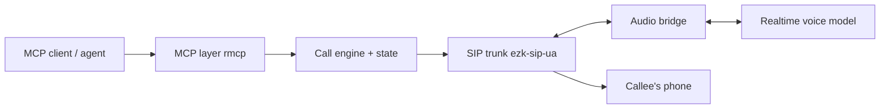

<p align="center">
  
</p>

<p align="center">
  Outbound phone calls as an MCP tool: dial over any SIP trunk, bridge the audio to a realtime
  voice model, let the model run the conversation.<br/>
  One Rust binary (<code>kutsu</code>); any SIP provider or self-hosted PBX;
  <a href="https://ai.google.dev/gemini-api/docs/live">Gemini Live</a> first, OpenAI Realtime next.
</p>

<p align="center">
  <a href="#quickstart">Quickstart</a> ·
  <a href="#architecture">Architecture</a> ·
  <a href="#mcp-tools">MCP tools</a> ·
  <a href="#status">Status</a> ·
  <a href="LICENSE">MIT</a>
</p>

*Kutsu* — Finnish for "a call / an invitation." Any MCP client (an agent, an IDE, another tool) calls `place_call` to have kutsu dial a number and run a scripted conversation end to end — the model owns turn-taking, barge-in, and its own tool-calling for the duration of the call — then polls for status and collects the [call outcome](#call-outcomes): transcript, a filled goal JSON, and the audio recording.

## Why kutsu

- **Generic SIP, not a vendor API** — works with any SIP trunk provider or self-hosted PBX; no Twilio-style lock-in.
- **Async by design** — `place_call` returns a `call_id` immediately; the call runs in the background and separate tools poll/control it. No MCP tool-call timeouts (often ~60s) on calls that run minutes.
- **The model drives the call** — a realtime speech-to-speech model handles turn-taking, barge-in, and its own tool calls; kutsu bridges audio and state.
- **Pluggable voice model** — providers sit behind one `RealtimeProvider` trait: Gemini Live in v1, OpenAI Realtime next, Amazon Nova Sonic possible.
- **One binary** — Rust, stdio MCP for local agents, streamable HTTP for deployment.

## Quickstart

> Kutsu is an early scaffold — the commands below show the intended interface, not working software yet. See [Status](#status).

```bash
cargo build --release
./target/release/kutsu mcp --transport stdio
# or over HTTP:
./target/release/kutsu mcp --transport streamable-http --bind 127.0.0.1:8090
```

On Windows, the binary is `target\release\kutsu.exe`. Building requires a system OpenSSL (needed by `ezk-srtp` for SRTP): install via vcpkg (`vcpkg install openssl:x64-windows-static-md` + set `VCPKG_ROOT`), or use the `vendor-openssl` feature (needs `perl` and `nasm` on PATH).

## Architecture



- **SIP leg** (`ezk-sip-ua` / `ezk-rtc`): outbound `INVITE`, RTP media, G.711 8kHz mu-law/PCM.
- **Audio bridge**: transcodes G.711 8kHz ↔ PCM16 16k/24k both ways in realtime.
- **Realtime provider** (`RealtimeProvider` trait): open a session, stream audio both ways, surface events (transcript, tool calls, barge-in, turn complete), return tool results. Implementations: Gemini Live (`BidiGenerateContent` WebSocket, session resumption) in v1; OpenAI Realtime next. Provider quirks — resumption mechanics, async-tool semantics like Gemini's `scheduling` — stay inside the implementation.
- **Call engine**: owns `CallRecord` / `TranscriptEntry` / `CallState`; one call at a time in v1.

## MCP tools

| Tool | What it does |
|------|--------------|
| `place_call` | Dial a number with a conversation script; returns `call_id` immediately |
| `get_call_status` | Poll call state (dialing, in-progress, completed, failed) |
| `get_call_transcript` | Fetch the running or final transcript |
| `end_call` | Force hangup |
| `list_calls` | List known calls and their states |

## Call outcomes

Every completed call must yield three artifacts, not just a transcript (planned — see [Status](#status)):

| Artifact | What it is |
|----------|------------|
| **Transcript** | Timestamped `TranscriptEntry` list: both sides of the conversation plus tool calls the model made |
| **Goal JSON** | A structured result filled in during the call. `place_call` accepts a goal schema (contact fields, appointment, disposition, scenario-specific flags); the model fills it via tool calls (`save_contact`, `set_appointment`, `end_call(reason)`, …), and kutsu merges those calls into the final JSON |
| **Recording** | Audio of the full call (both legs), saved to disk and retrievable after hangup |

How the goal JSON gets filled: the scenario declares tools and a goal schema, tool-call arguments are merged into the goal object as the call progresses, and `end_call(reason)` sets the final disposition (appointment, callback, refused, wrong contact, …).

## In-call tool bridge (webhook)

Planned. Beyond goal-tracking tools, `place_call` accepts declarations of **external tools** plus a `tool_webhook` URL. When the model calls such a tool mid-conversation (e.g. `send_email` — "I've just sent it, could you check your inbox?"), kutsu does not execute it; it bridges the call out:

1. kutsu POSTs the tool call (`call_id`, tool call `id`, name, arguments) to `tool_webhook`.
2. The receiver **acks immediately** (2xx) and executes in the background — a fast, quality implementation on the receiving side is part of the contract; kutsu never holds the call hostage to a slow endpoint.
3. When done, the receiver POSTs the result back to kutsu's callback endpoint; kutsu forwards it to the model as a `FunctionResponse` with a `scheduling` hint (`INTERRUPT` / `WHEN_IDLE` / `SILENT`).

External tools are declared `NON_BLOCKING`, so the model keeps talking while the tool runs — no dead air on the phone. If the callee barges in and the model's pending tool calls get cancelled, kutsu notifies the webhook receiver with a cancellation event so in-flight work can be aborted or its result discarded.

## Status

Early scaffold. Nothing works yet. Build phases:

1. SIP spike (`ezk-sip-ua`/`ezk-rtc`) — outbound `INVITE`, raw RTP frames.
2. `RealtimeProvider` trait + Gemini Live implementation (`BidiGenerateContent`, session resumption, tool bridging).
3. Audio bridge (G.711 8kHz mu-law/PCM ↔ PCM16 16k/24k).
4. Call engine + state (`CallRecord`/`TranscriptEntry`/`CallState`).
5. MCP layer (`rmcp`): the five tools above.
6. Call outcomes: goal JSON (schema in `place_call`, merged from model tool calls) + call recording to disk.
7. In-call tool bridge: webhook out, async result callback in, `NON_BLOCKING` + `scheduling`, barge-in cancellation.
8. Config, docs, tests.
9. Second provider: OpenAI Realtime — validates the `RealtimeProvider` trait doesn't leak Gemini specifics.

### Design decisions

- **Telephony**: generic SIP trunk (any provider or self-hosted PBX), not a specific vendor API.
- **Execution model**: async — `place_call` returns a `call_id` immediately; the call runs in the background; separate tools poll/control it.
- **Scope for v1**: one call at a time. No campaign/queue/DNC list — that is an explicit, separate follow-up.
- **External actions via webhook, not built-in**: kutsu never implements email/SMS/CRM itself. Mid-call actions go through the tool bridge; the webhook receiver acks instantly and owns execution quality.
- **Provider-agnostic voice model**: all realtime speech-to-speech APIs (Gemini Live, OpenAI Realtime, Amazon Nova Sonic) share the same shape — bidirectional session, PCM16 audio, tool calls with ids, barge-in events — so they sit behind one trait. kutsu owns the telephony; the brain is swappable. Gemini Live ships first (cheapest, proven flow); OpenAI Realtime second.
- **Proven conversation flow**: the conversation logic (scenario tools, goal merging, dispositions, turn-taking against Gemini Live) was validated in an earlier Python prototype; kutsu ports that flow to Rust and puts a real SIP leg and MCP interface around it.

## License

MIT — see [LICENSE](LICENSE).
